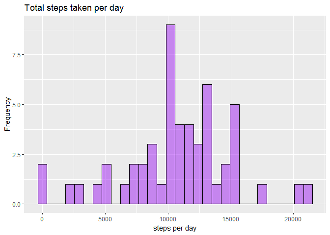
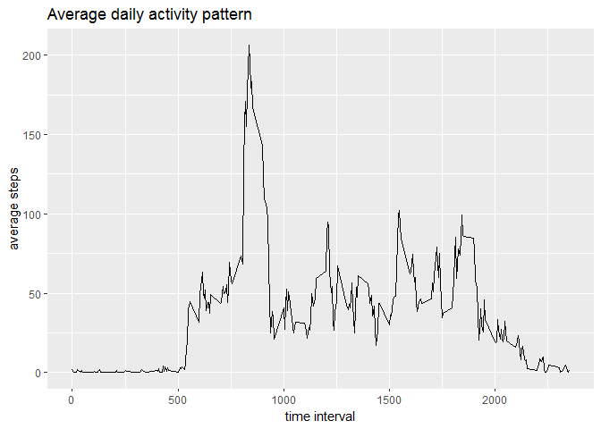
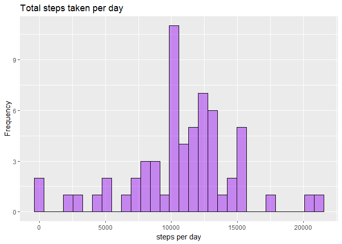
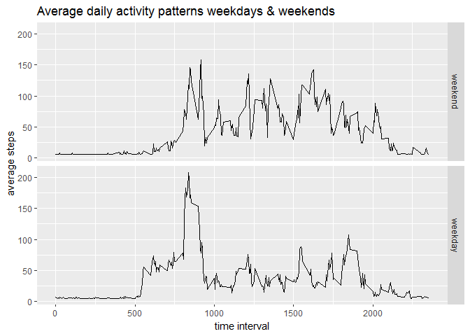

This assignment makes use of data from a personal activity monitoring device. This device collects data at 5 minute intervals through out the day. The data consists of two months of data from an anonymous individual collected during the months of October and November, 2012 and include the number of steps taken in 5 minute intervals each day.

The variables included in this dataset are:

- **steps**: Number of steps taking in a 5-minute interval
- **date**: The date on which the measurement was taken in YYYY-MM-DD format
- **interval**: Identifier for the 5-minute interval in which measurement was taken

The dataset is stored in a comma-separated-value (CSV) file and there are a total of 17,568 observations in this dataset.

Before even loading any data I set `echo = TRUE` such that all of my code is visible in the final document and suppress any warning messages. I also load up my preferred graphics package `ggplot2`.

```r
knitr::opts_chunk$set(warning=FALSE)
knitr::opts_chunk$set(echo=TRUE)
library(ggplot2)
```

## Loading and preprocessing the data

**Show any code that is needed to**

**1. Load the data (i.e. `read.csv()`)**

Since we are told the data is stored in a csv file I simply read in the data using `read.csv` and store it in a dataframe object called `rawData`.

```r
rawData <- read.csv("activity.csv")
```

**2. Process/transform the data (if necessary) into a format suitable for your analysis**

It's always useful to take a look at the data to see what it looks like and if transformations are required. As expected, the command `dim` tells us the data is 17,568 rows and 3 columns. Calling command `str` we see that the variable "steps" is in integer format with the first few missing values coded as NA. We also note that the "date" column is as a factor variable. Generally I always find it easier to work with them as dates so I will complete that transformation.Rerunning `str` confirms that it is now in Date format.

```r
dim(rawData)
```

```
## [1] 17568     3
```

```r
str(rawData)
```

```
## 'data.frame':	17568 obs. of  3 variables:
##  $ steps   : int  NA NA NA NA NA NA NA NA NA NA ...
##  $ date    : Factor w/ 61 levels "2012-10-01","2012-10-02",..: 1 1 1 1 1 1 1 1 1 1 ...
##  $ interval: int  0 5 10 15 20 25 30 35 40 45 ...
```

```r
rawData$date <- as.Date(as.character(rawData$date, "%y-%m-%d"))
str(rawData)
```

```
## 'data.frame':	17568 obs. of  3 variables:
##  $ steps   : int  NA NA NA NA NA NA NA NA NA NA ...
##  $ date    : Date, format: "2012-10-01" "2012-10-01" ...
##  $ interval: int  0 5 10 15 20 25 30 35 40 45 ...
```

## What is mean total number of steps taken per day?

**For this part of the assignment, you can ignore the missing values in
the dataset.**

**1. Make a histogram of the total number of steps taken each day**

Using the `aggregate` function I calculate the number of steps per day while ignoring the missing values. I save the result in `dailySteps` and use `ggplot` to plot a histogram.

```r
dailySteps <- aggregate(steps~date, rawData, FUN=sum, na.rm=TRUE)

png('plot1.png')

g1<- ggplot(dailySteps,aes(steps)) + 
  geom_histogram(bins=30, fill="purple", col="black", alpha=0.5) +
  ylab("Frequency") + 
  xlab("steps per day") + 
  ggtitle("Total steps taken per day")

print(g1)
dev.off()
```

```
## png 
##   2
```

```r
g1
```

<!-- -->


**2. Calculate and report the mean and median total number of steps taken per day**

I simply find the mean and median of the "steps" column saved in `dailySteps`.

```r
meanDailySteps <- mean(dailySteps$steps)
meanDailySteps
```

```
## [1] 10766.19
```

```r
medianDailySteps <- median(dailySteps$steps)
medianDailySteps
```

```
## [1] 10765
```
The mean of total number of steps taken per day is 1.0766189\times 10^{4}.  
The median of total number of steps taken per day is 10765.  

## What is the average daily activity pattern?

**1. Make a time series plot (i.e. `type = "l"`) of the 5-minute interval (x-axis) and the average number of steps taken, averaged across all days (y-axis)**

Similar to before I use the `aggregate` function to find the mean number of steps per interval. I save the result in `intervalSteps` and use `ggplot` to make a line chart.

```r
intervalSteps <- aggregate(steps~interval, rawData, FUN=mean, na.rm=TRUE)

png('plot2.png')

g2 <- ggplot(intervalSteps,aes(interval, steps)) + 
  geom_line(col="black") +
  ylab("average steps") + 
  xlab("time interval") + 
  ggtitle("Average daily activity pattern")

print(g2)
dev.off()
```

```
## png 
##   2
```

```r
g2
```

<!-- -->

**2. Which 5-minute interval, on average across all the days in the dataset, contains the maximum number of steps?**

To do this I use the `which` function to find which interval contains the max mean number of steps.

```r
index <- which(intervalSteps$steps == max(intervalSteps$steps))
maxInterval <- intervalSteps$interval[index]
maxInterval
```

```
## [1] 835
```
The interval containing the maximum number of steps is 835.

## Imputing missing values

**Note that there are a number of days/intervals where there are missing values (coded as `NA`). The presence of missing days may introduce bias into some calculations or summaries of the data.**

**1. Calculate and report the total number of missing values in the dataset (i.e. the total number of rows with `NA`s)**

We saw initially that there were missing values coded as NA. Let's count the number and see the percentage.

```r
percentNA <- mean(is.na(rawData$steps))
percentNA
```

```
## [1] 0.1311475
```

```r
countNA <- sum(is.na(rawData$steps))
countNA
```

```
## [1] 2304
```
The total number of missing values is 2304. This is 13.1147541% as a percentage of the total observations. 

**2. Devise a strategy for filling in all of the missing values in the dataset. The strategy does not need to be sophisticated. For example, you could use the mean/median for that day, or the mean for that 5-minute interval, etc.**

A new column is added to the rawData dataframe called "days" which states what day of the week each date is. I then create a lookup table called `dayMean` of the mean number of steps per day, that is the mean for Monday, mean for Tuesday etc. The NAs will be replaced by the corresponding means for the the gven days.

```r
days <- weekdays(rawData$date)
data <- cbind(rawData, days)

dayMean <- aggregate(steps~days, data, FUN=mean)
dayMean
```

```
##        days    steps
## 1    Friday 42.91567
## 2    Monday 34.63492
## 3  Saturday 43.52579
## 4    Sunday 42.63095
## 5  Thursday 28.51649
## 6   Tuesday 31.07485
## 7 Wednesday 40.94010
```

**3. Create a new dataset that is equal to the original dataset but with the missing data filled in.**

Another new column containing the means for each day is now appended to the dataframe. All of the NA values are then replaced with the mean for the appropriate day.

```r
newData <- merge(dayMean, data, by="days")
newData <- newData[order(newData$date, newData$interval), ]
newData$steps.y[which(is.na(newData$steps.y))] <- newData$steps.x[which(is.na(newData$steps.y))]
newData <- subset(newData, select=-steps.x)
names(newData)[names(newData) == "steps.y"] <- "steps"
```

**4. Make a histogram of the total number of steps taken each day and Calculate and report the mean and median total number of steps taken per day. Do these values differ from the estimates from the first part of the assignment? What is the impact of imputing missing data on the estimates of the total daily number of steps?**

I use the `aggregate` function to sum up the total number of steps per day and save the result in `newDailySteps`. This is then plotted as a histogram using `ggplot`.

```r
newDailySteps <- aggregate(steps~date, newData, FUN=sum, na.rm=TRUE)

png('plot3.png')

g3 <- ggplot(newDailySteps,aes(steps)) + 
  geom_histogram(bins=30, fill="purple", col="black", alpha=0.5) +
  ylab("Frequency") + 
  xlab("steps per day") + 
  ggtitle("Total steps taken per day")

print(g3)
dev.off()
```

```
## png 
##   2
```

```r
g3
```

<!-- -->

We now look at the newmean and median total number of steps per day and compare to the non-imputed data. 

```r
meanNewDailySteps <- mean(newDailySteps$steps)
meanNewDailySteps
```

```
## [1] 10821.21
```

```r
medianNewDailySteps <- median(newDailySteps$steps)
medianNewDailySteps
```

```
## [1] 11015
```
The mean of total number of steps taken per day using the imputed data is 1.082121\times 10^{4}.  
The median of total number of steps taken per day using the imputed data is 1.1015\times 10^{4}.  
Unsurprisisingly, given that we are added non-zero values, both the mean and median have increased slightly. In fact the mean of the imputed data is greater by 55.0209226 steps, whereas the median is larger by 250 steps. Results will vary depending on the chosen method for imputing the data.

## Are there differences in activity patterns between weekdays and weekends?

**For this part the `weekdays()` function may be of some help here. Use
the dataset with the filled-in missing values for this part.**

**1. Create a new factor variable in the dataset with two levels -- "weekday" and "weekend" indicating whether a given date is a weekday or weekend day.**

I begin by creating a new vector called "weekend" which contains the character strings "Saturday" and "Sunday". I then create a 2-level factor variable dpending on wether or not the "days" value is in the weekend vector or not. Running the `str` command confirms that the new factor variable called `wDay` has 2 levels called "weekday" and "weekend".

```r
weekend <- c("Saturday", "Sunday")
newData$wDay <- factor((newData$days %in% weekend), levels=c(TRUE, FALSE), labels=c('weekend', 'weekday'))
str(newData)
```

```
## 'data.frame':	17568 obs. of  5 variables:
##  $ days    : Factor w/ 7 levels "Friday","Monday",..: 2 2 2 2 2 2 2 2 2 2 ...
##  $ steps   : num  34.6 34.6 34.6 34.6 34.6 ...
##  $ date    : Date, format: "2012-10-01" "2012-10-01" ...
##  $ interval: int  0 5 10 15 20 25 30 35 40 45 ...
##  $ wDay    : Factor w/ 2 levels "weekend","weekday": 2 2 2 2 2 2 2 2 2 2 ...
```

**1. Make a panel plot containing a time series plot (i.e. `type = "l"`) of the 5-minute interval (x-axis) and the average number of steps taken, averaged across all weekday days or weekend days (y-axis).**

I use the `aggregate` function again to get the average of steps per interval split by the new factor variable. I make the panel plot with `ggplot` using facet-grid to split by the two factor variable.

```r
wDaySteps <- aggregate(steps~interval+wDay, newData, FUN=mean, na.rm=TRUE)

png('plot4.png')

g4 <- ggplot(wDaySteps,aes(interval, steps)) + 
  geom_line(col="black") +
  facet_grid(wDay ~. ) +
  ylab("average steps") + 
  xlab("time interval") + 
  ggtitle("Average daily activity patterns weekdays & weekends")

print(g4)
dev.off()
```

```
## png 
##   2
```

```r
g4
```

<!-- -->
